# AIR 동작에 대한 검증 및 Defender API Data를 통한 Alert Evidence 추출

<aside>
🤖

**에이전트 판단 결과**

- 상태: 완료
- 카테고리: 보안/권한/인증
- 공식 문서: [Automated investigations in Microsoft Defender for Endpoint](https://learn.microsoft.com/en-us/defender-endpoint/automated-investigations), [List alerts API](https://learn.microsoft.com/en-us/defender-endpoint/api/get-alerts)
- 근거: Microsoft 공식 문서 링크가 포함되어 있고, Atomic Red Team 기반 검증 절차와 Defender API 조회 예시, 스크린샷, PowerShell 예제가 함께 정리되어 있으며 문서 마지막에 검증 완료 결론이 명확히 제시되어 있습니다.
</aside>

Microsoft Defender for Endpoint 에서는 위협 행위가 발생 했을 떄 Antivirus Engine 에 의해 프로세스 차단 또는 위협 파일에 대한 격리를 수행한다.

이 때 Automated Investigation and Response 기능에 의해 위협 행위가 차단되고 공격 행위에 대한 자동 조사가 이뤄진다.

공격 행위가 인식되었을 때 행위에 대한 검증 수준이 AIR 이 동작 할 수준의 조건이 트리거 되었다면 아래와 같이 Machine Group 에 할당 된 Automation Level 별 Remediation 이 수행된다

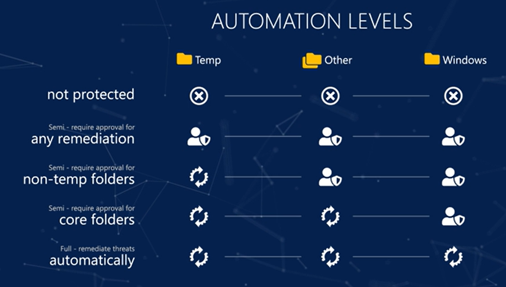

크게 Not Protect, Semi, Full 로 구분되며 레벨 별로 동작하는 범위가 다른것을 알 수 있다.

AIR 동작을 좀 더 알기 쉽게 정리했을 때 아래와 같은 흐름으로 AIR 동작을 정의 할 수 있다.

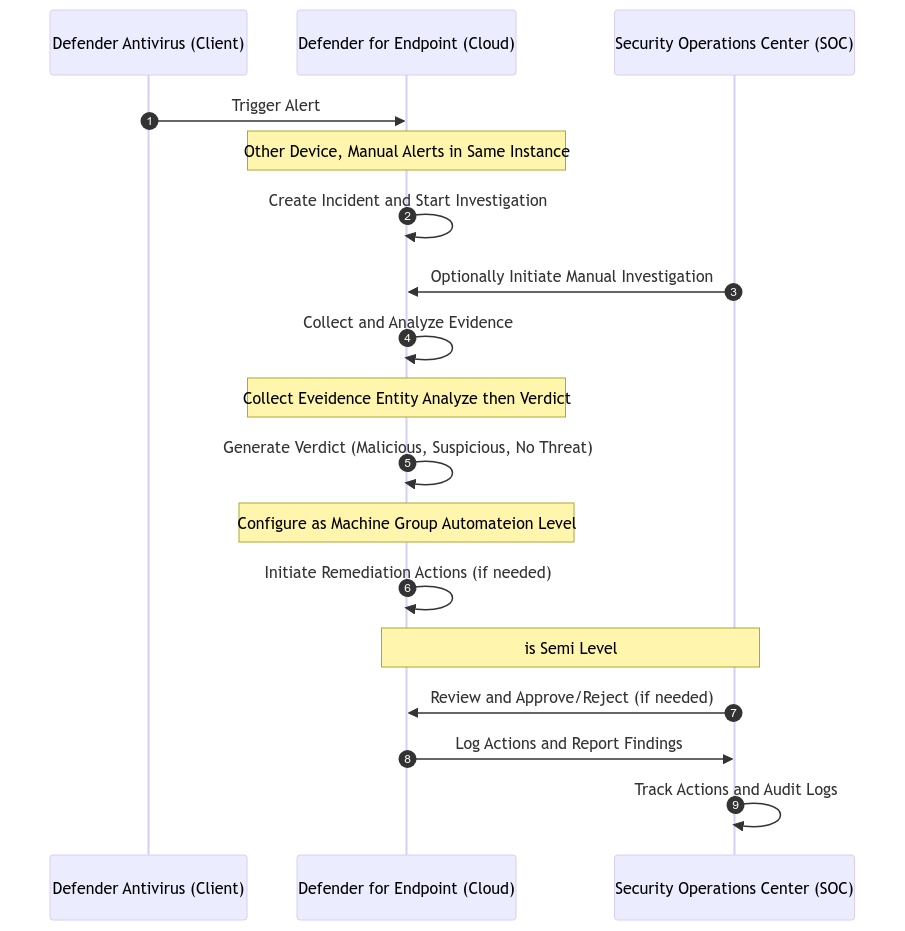

1. **Defender Antivirus(Client)*\***는 엔드포인트에서 위협을 탐지하고 위협 탐지 시 경고(Alert)를 Defender for Endpoint(Cloud)* *로 전송.
2. 클라우드는 수신된 경고를 분석하여 사건(Incident)을 생성하고 경고와 관련된 모든 데이터를 기반으로 **자동 조사를 시작** 한다. (MSDOC: [자동화된 조사가 시작되는 방법](https://learn.microsoft.com/en-us/defender-endpoint/automated-investigations))
    
    이 때 조사 범위는 경고가 발생한 장치와 동일한 위협을 가진 다른 장치의 경고를 포함하여 확장 될 수 있음. (MSDOC: [자동화된 조사가 범위를 확장하는 방식](https://learn.microsoft.com/en-us/defender-endpoint/automated-investigations#how-an-automated-investigation-expands-its-scope))
    
3. 보안 운영 센터(SoC) 에서 필요에 따라 수동으로 조사를 Trigger 할 수 있으며 이 경우 동일한 조사 유형이 있을 때 자동으로 조사 인스턴스에 추가됨.
4. 조사 중 클라우드는 관련 데이터를 수집(파일, 프로세스, 네트워크 연결 등)하고, 수집된 데이터를 Threat Intelligence와 머신러닝 모델로 분석하여 위협 여부를 평가.
5. 분석 결과를 기반으로 수집된 각 증거에 대한 판정을 3가지 유형으로 생성하고 반환하여 수정작업 및 조사 종료 여부 결정 항목으로 사용함.
    - **Malicious**: 명백히 악성인 증거.
    - **Suspicious**: 추가 검토가 필요한 잠재적 위협.
    - **No Threat**: 위협으로 간주되지 않음.
6. 판정 결과에 따라 필요한 경우 수정 작업을 시작(ex) 파일 격리, 악성 프로세스 종료, 네트워크 연결 차단, etc…)
    
    이 때 수정 작업의 자동화 수준은 **Machine Group의 설정**(Full, Semi, Manual)에 따라 조정.
    
7. 자동화 수준이 "Semi" 또는 "Manual"로 설정된 경우 SOC 팀이 수정 작업을 검토하고 승인(Approve) 또는 거절(Reject) 하기 전 까지 수정 작업이 실행되지 않음.
8. 수행된 모든 수정 작업과 결과를 **Action Center**에 기록하고 SoC는 수정 작업의 결과 및 조사 보고서를 검토.
9. SOC 팀은 모든 작업 기록을 검토하고 필요 시 작업을 취소하거나 감사 로그를 통해 추가 정보를 확인 하고 수정 작업 및 조사 기록은 보안 감사의 근거 자료로 활용.

동작 과정에 대해 알아봤으므로 이제 실제 공격 행위를 가정한 시뮬레이션을 진행했을 때 경고에 대한 진행 주체를 통한 AIR 동작을 확인 할 수 있다.

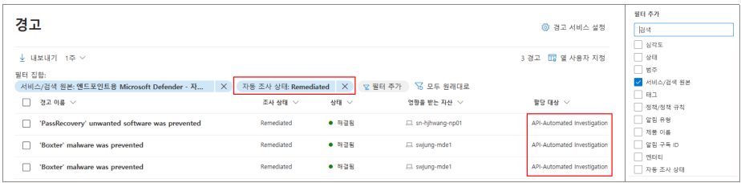

하지만 필터 구성을 살펴봤을 때 **할당 대상** 필드는 필터에서 사용 할 수 없으며 AIR 에 대한 자동조사 및 조치에 대한 내용이 기록되는 작업 센터에 대한 데이터는 고급 헌팅에서도 데이터가 제공되는 테이블이 없는것으로 확인된다.

이 경우 Defender API 를 통해 Alerts Endpoint 를 쿼리했을 때 AssignedTo 필드에서 AIR 동작에 대한 내용을 표기하는 것을 확인 할 수 있다.

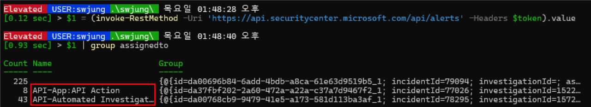

이제 Defender 에서 사전 정의된 Malware 공격을 방어 할 수 있는지에 대한 부분과 AIR 동작 시 생성되는 조사 내용 및 조치 항목에 대한 부분을 검증한다.

우선 아래와 같이 Red, Blue Team 머신을 구성에 맞도록 테스트 환경을 준비한다. (Atomic Red Team 환경구성에 대한 부분은 문서:Atomic Red Team 을 사용한 MITRE ATT&CK 공격 시나리오 구현 를 참고한다)

| **Role** | **Protocol** | **Tools** | **Onboarding** |
| --- | --- | --- | --- |
| Red Team | Tls 1.2(Required) | Atomic Red Team | No |
| Blue Team | TLS 1.2(Optional) | No | Yes |

테스트 환경이 준비되면 Red Team 의 공격 구성을 위해 TrustedHost, WinRM 구성을 완료하고 Blue Team Client 세션에 구성하여 준비를 완료한다.

이 문서에서 실행 할 공격 항목은 MITRE ATT&CK Library 중 아래 내용을 실행하여 이 공격의 방어 여부를 검증한다.

T1548.002([남용 상승 제어 메커니즘: 사용자 계정 제어 우회](https://github.com/redcanaryco/atomic-red-team/blob/master/atomics/T1548.002/T1548.002.md))

기본적으로 RedTeam 은 아래와 유사하게 BlueTeam 에 대한 Powershell RemoteSession 을 생성하고 여기에 Fileless 공격 또는 첨부파일에 의한 악성코드 실행을 시도하게된다.

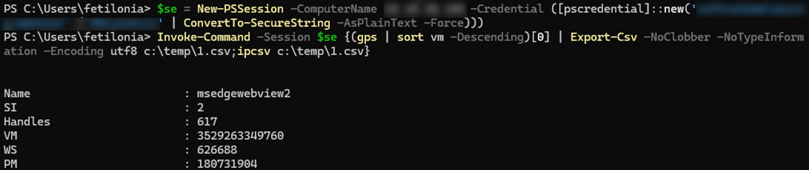

# **Atomic Test 실행을 통한 AIR 동작 검증**

권한상승 공격에 대한 Defender AV 방어 테스트를 위해 MITRE ATT&CK Library [남용 상승 제어 메커니즘: 사용자 계정 제어 우회](https://github.com/redcanaryco/atomic-red-team/blob/master/atomics/T1548.002/T1548.002.md) 의 Atomic Tests 중 1번을 실행하는 방향으로 구성한다.

Atomic 1 은 아래와 같이 Attack Command 로 BlutTeam PC 에 Registry Add 동작을 시도한다.

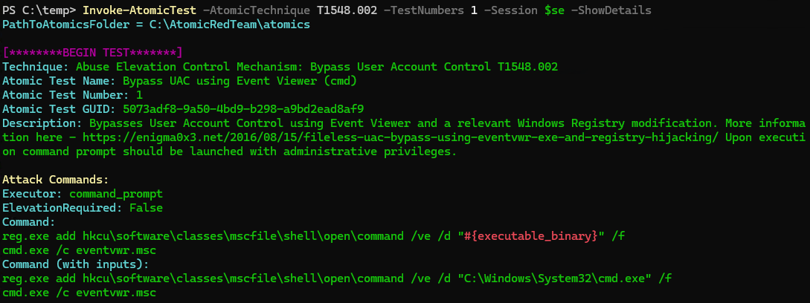

#{executable_binary} 는 [Github AtomicTest#1](https://github.com/redcanaryco/atomic-red-team/blob/master/atomics/T1548.002/T1548.002.md#inputs) 문서에 Default Value 가 아래와 같이 정의되어 있다.

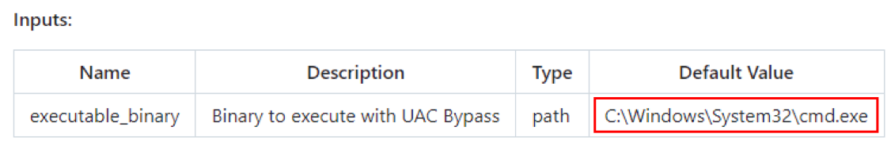

이제 -ShowDetails 파라미터를 제거한 상태로 명령을 실행하면 BlueTeam PC 에 공격이 실행되고 Atomic 1 의 공격 행위가 즉시 Malware 로 탐지되어 방어되는 것을 확인 할 수 있다.

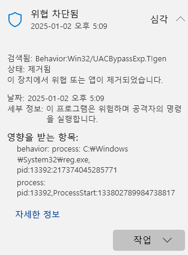

조금 더 자세한 내용을 확인하기 위해 Get-MpThreatDetection 명령을 실행하면 아래와 같이 공격 명령에 의해 실행된 commandline 이 격리된 것을 확인 할 수 있다.

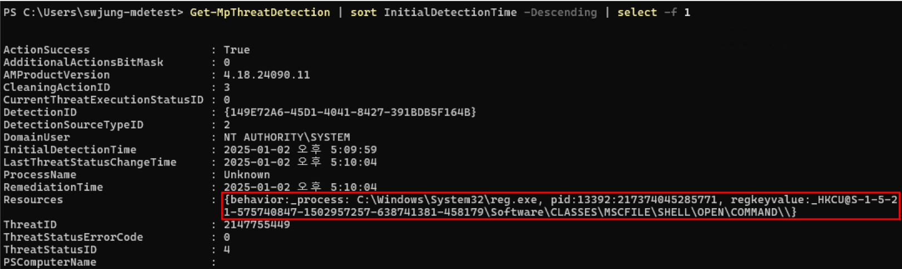

공격 행위는 센서에 의해 Defender SaaS Service 로 전송되며 데이터가 전송된 후 Alerts 페이지에 해당 Entity 가 표시되고 이 공격 행위가 UAC bypass 로 탐지된 것을 확인 할 수 있다.

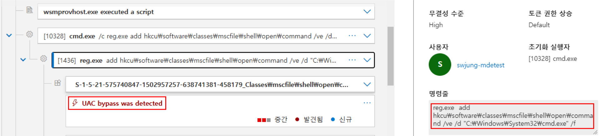

이는 Default File Association 을 제어해서 UAC 를 우회하는 동작을 수행하는 부분이며 T1548.002 테스트의 내용인 UACBypass 를 통한 횡방향 이동 공격이 수행되었지만 Defender 에서 이를 탐지하고 차단 한 것을 Incident 의 공격 스토리를 통해 확인 할 수 있다.

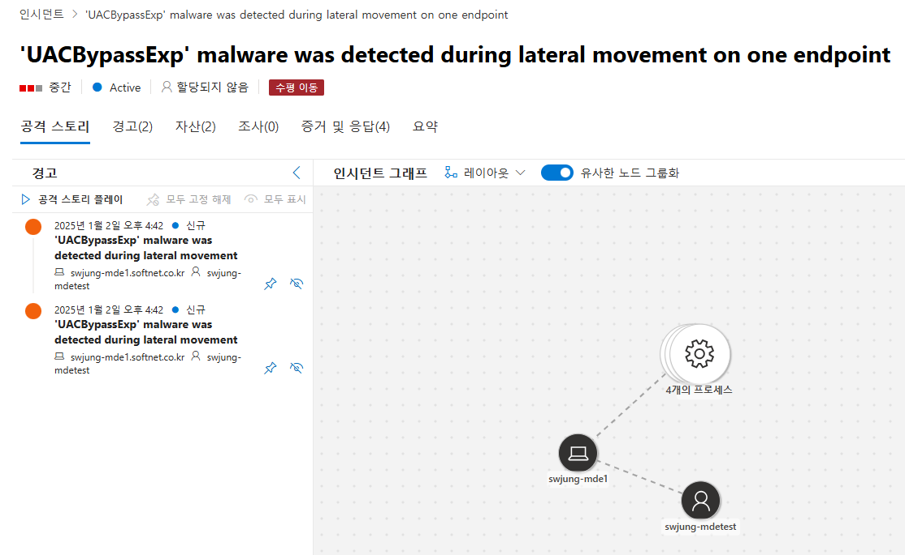

Malware 에 의한 횡방향 공격이 실행됐을 때 이 장치가 포함된 장치 그룹의 수준에 따라 자동 조사가 트리거 된 것을 검증하기 위해 Alerts 의 할당 대상 컬럼을 확인한다.
컬럼 값을 확인했을 때 UACBypassExp 경고의 할당 대상 컬럼에 AIR 이 할당되었고 조사 상태는 위협 없음이 기록된 것을 알 수 있다.

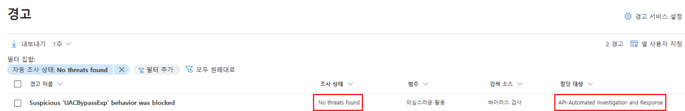

이는 이 경고에 대한 조사 결과의 증거에서 아래와 같이 cmd.exe 파일에 포함된 악성 행위가 없다는 것을 의미한다.
FileLess 공격에 해당하는 부분이므로 증거에 포함되는 파일은 프로세스를 실행한 주체가 탐지되는 것을 알 수 있다.

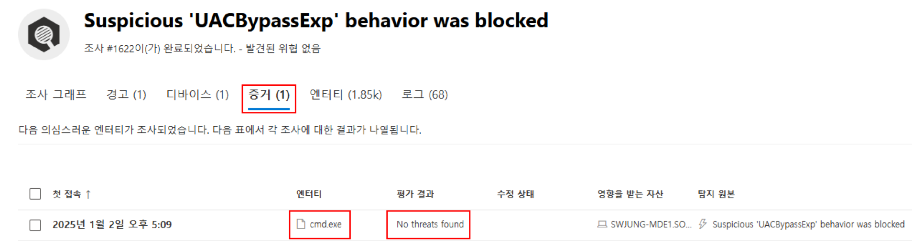

이것으로 Atomic-Redteam Powershell Module 을 통한 BlueTeam PC 를 공격했을 때 Defender 가 공격을 방어하고 위협 행위에 대한 자동 조사 및 응답을 제공하는 것을 검증하였다.

# **AIR 이 트리거 된 경고 검색**

이번에는 Alerts Entity 중 AIR 이 트리거 된 항목을 검색하는 내용을 검증한다.

Alerts 페이지에서 할당 대상 필드에 API-Automated Investigation and Response 가 포함된 경고를 필터링을 사용 할 수는 없다.
AIR 검사가 실행된 Alerts Entity 를 명시적으로 검색하기 위해서는 Defender API 를 사용하여 Alerts Endpoint 에 접근하여 AssignedTo 필드 값을 사용 할 수 있다.

우선 Defender API 에 접근하기 위해 MS DOC:[Supported Microsoft Defender for Endpoint APIs](https://learn.microsoft.com/en-us/defender-endpoint/api/exposed-apis-list) 문서를 참고하여 Entra ID App 을 생성해서 Security API 에 접근하도록 구성한다.

Security API 에 접근 할 수 있는 권한을 할당하고 아래와 같이 Defender API 의 Alerts Endpoint 를 쿼리했을 때 StatusCode 로 200을 반환해야 한다.

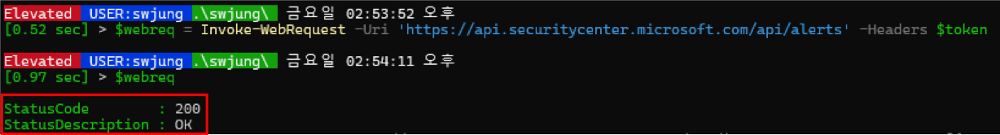

위 예시는 반환 코드 예시를 확인하기 위해 Invoke-WebRequest Cmdlet 을 사용했지만 Invoke-RestMethod 명령을 사용할 경우 Request 의 기본 포맷은 JSON 유형이 된다.

- Invoke-WebRequest 명령 실행 결과에서 Content 필드 호출 결과
    
    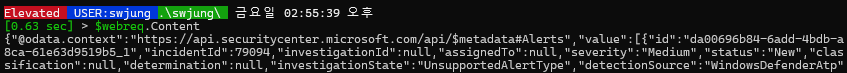
    
- Invoke-RestMethod 명령 실행 결과
    
    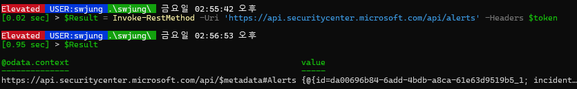
    

이는 명시적으로 Header 파라미터에 포함된 Hashtable 의 Content-Type Key 값에 JSON 을 지정하더라도 동일한 결과를 반환하게 되므로 참고하도록 한다.

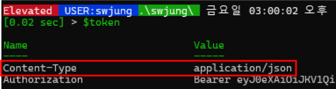

이 중 Alerts Endpoint 반환 결과에서 AIR 이 트리거된 경고 목록을 아래와 같이 수집 할 수 있다.

```powershell
$Result.value | Where-Object assignedto -like '*automate*'
```

- Return Console
    
    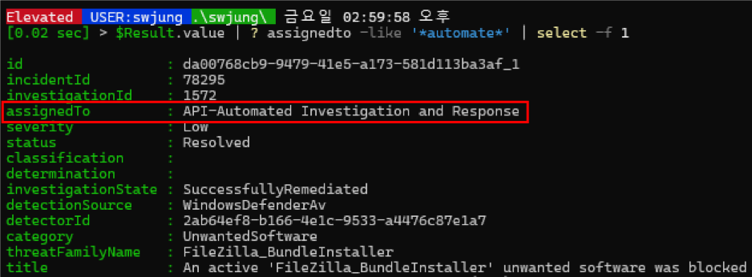
    

이 중 필요한 항목은 assignedTo 필드의 API-Automated Investigation and Response 항목이며 이 경고에 연결된 파일 목록을 추출하기 위해 ID 필드 값을 제공하여 연결된 파일 정보를 가져 올 수 있다.

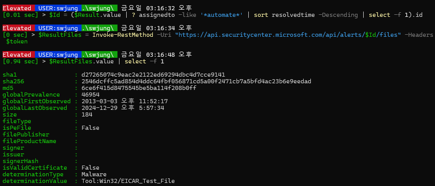

경고 ID 를 활용해서 연결 가능한 정보는 아래와 같다. 모든 항목은 분당 100개의 호출, 시간당 1500개 의 호출 제한을 가진다.

| **Item** | **Description** |
| --- | --- |
| [Domain](https://learn.microsoft.com/en-us/defender-endpoint/api/get-alert-related-domain-info#http-request) | 특정 알림과 관련된 모든 도메인을 검색 |
| [File](https://learn.microsoft.com/en-us/defender-endpoint/api/get-alert-related-files-info#http-request) | 특정 알림과 관련된 모든 파일을 검색 |
| [IP](https://learn.microsoft.com/en-us/defender-endpoint/api/get-alert-related-ip-info#http-request) | 특정 알림과 관련된 모든 IP를 검색 |
| [Device](https://learn.microsoft.com/en-us/defender-endpoint/api/get-alert-related-machine-info#http-request) | 특정 알림과 관련된 장치를 검색 |
| [User](https://learn.microsoft.com/en-us/defender-endpoint/api/get-alert-related-user-info#http-request) | 특정 알림과 관련된 사용자를 검색 |

AIR 을 트리거한 경고와 증거 파일을 수집했으므로 이를 토대로 관리자용 보고서를 생성 할 수 있다.

> Alerts Reports Script
> 
> 
> ```powershell
> # Token Credential 
> $Credential = @{
>     ClientId     = '<AppId>'
>     TenantId     = '<TenantId>'
>     ClientSecret = '<ClientSecret>'
>     Service      = 'MDE'
> }
> $Token = Get-GraphToken @Credential
> # Return All Alerts
> $Result = Invoke-RestMethod -Uri "https://api.securitycenter.microsoft.com/api/alerts" -Headers $Token
> foreach ($alert in $Result.value) {
>     # Return All Files
>     $ResultFiles = Invoke-RestMethod -Uri "https://api.securitycenter.microsoft.com/api/alerts/$($alert.id)/files" -Headers $Token
>     foreach ($File in $ResultFiles.value) {
>         [pscustomobject]@{
>             AlertPage           = "https://security.microsoft.com/alerts/$($alert.id)?tid=$($alert.aadTenantId)" # Alert Page
>             IncidentPage        = "https://security.microsoft.com/incident2/$($alert.incidentId)/overview?tid=$($alert.aadTenantId)" # Incident Page
>             investigationState  = $alert.investigationState # Active, Resolved
>             detectionSource     = $alert.detectionSource  
>             category            = $alert.category # SuspiciousActivity, SuspiciousNetworkActivity, SuspiciousLoginActivity, Malware, Phishing, Other
>             threatFamilyName    = $alert.threatFamilyName # Trojan:Win32/Wacatac, Trojan:Win32/Emotet, etc...
>             Title               = $alert.title 
>             AlertCreateTime     = $alert.alertCreationTime 
>             resolvedTime        = $alert.resolvedTime # If the alert is resolved
>             ComputerName        = $alert.computerDnsName 
>             MITRE               = $alert.mitreTechniques # MITRE ATT
>             LogonUser           = $alert.loggedOnUsers 
>             EvidenceSha1        = $File.sha1 # File Hash
>             EvidenceSha256      = $File.sha256 # File Hash
>             GlobalFirstObserved = $File.globalFirstObserved 
>             GlobalLastObserved  = $file.globalLastObserved
>             FileSize            = $file.size
>             determinationType   = $file.determinationType # Clean, Malicious, Suspicious
>             determinationValue  = $file.determinationValue # 
>         }
>         # Safty Sleep Time
>         Start-Sleep -Milliseconds 400
>     }
> }
> ```
> 

결과는 아래와 같이 경고에 대한 페이지 링크와 증거 파일이 포함된 데이터를 얻을 수 있다.

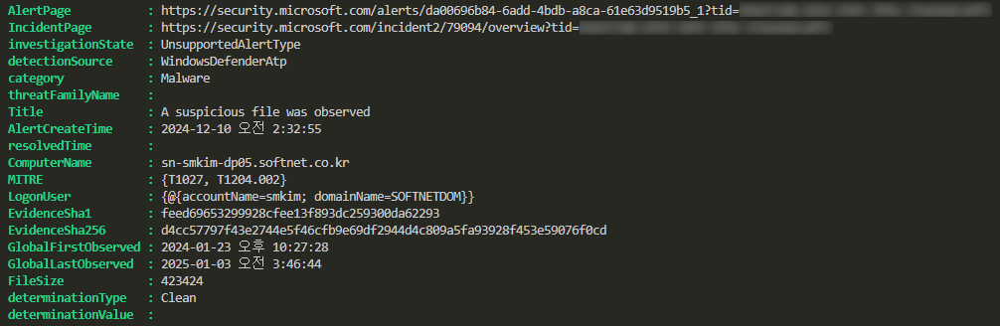

이것으로 Defender API 를 통한 AIR 이 트리거된 경고를 검색하는 것을 검증하였다.
