# Defender AMRunningMode 반환 구조 및 검증

Defender Antivirus의 active·passive·EDR in block mode를 구분하고 Windows Security Center 정보와 교차 검증합니다.

```powershell
Get-MpComputerStatus | Select-Object AMRunningMode, AntivirusEnabled,
  RealTimeProtectionEnabled, BehaviorMonitorEnabled, IsTamperProtected
```

`AMRunningMode`가 primary 판단 지점입니다. `root\SecurityCenter2:AntiVirusProduct.productState`는 보조 evidence이며 그 값만으로 backend mode의 root cause를 확정하지 않습니다.

| Mode | 일반적 조건 | 의미 |
|---|---|---|
| `Normal` | Defender가 primary AV | active protection |
| `Passive` | onboarded device에서 타사 AV가 primary | 실시간 remediation 비활성 |
| `EDR Block Mode` | EDR in block mode 활성 | post-breach 차단·remediation |

```powershell
Get-CimInstance -Namespace root/SecurityCenter2 -ClassName AntiVirusProduct |
  Select-Object displayName, productState, pathToSignedProductExe, timestamp
```

타사 AV 설치와 mode 변경의 상관관계만으로 원인을 확정하지 않습니다. onboarding, policy, OS, tamper protection과 device timeline을 같은 timestamp로 비교합니다.

## 원문 증적

??? example "AMRunningMode 검증 화면"
    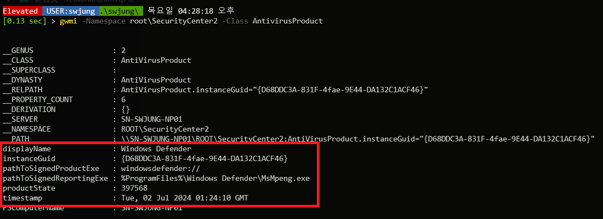
    
    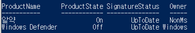
    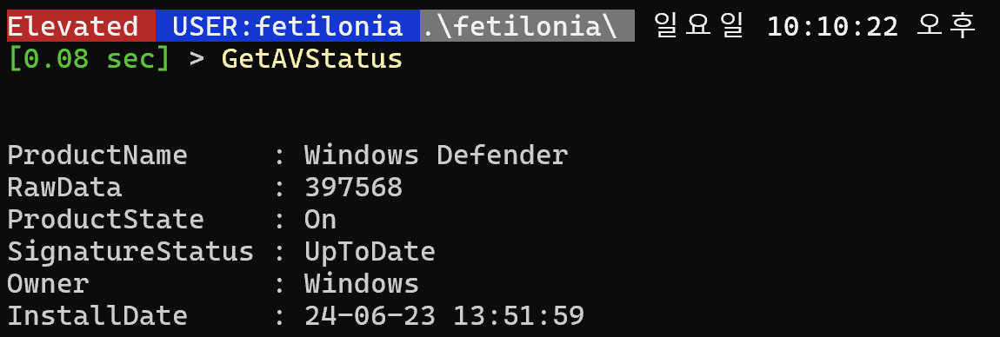
    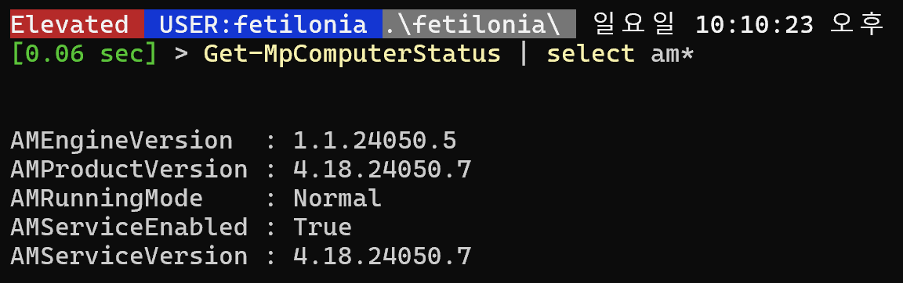
    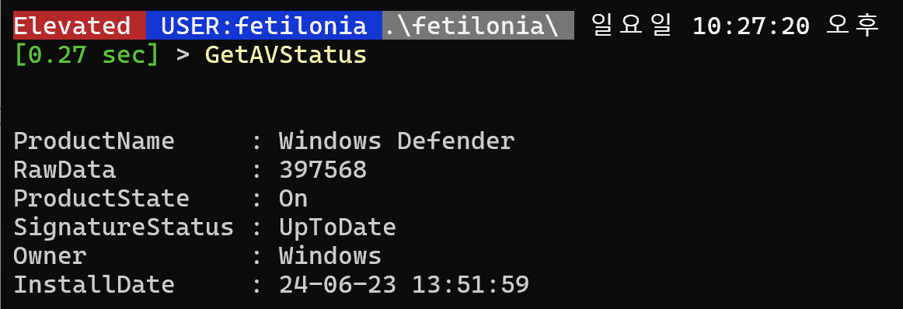
    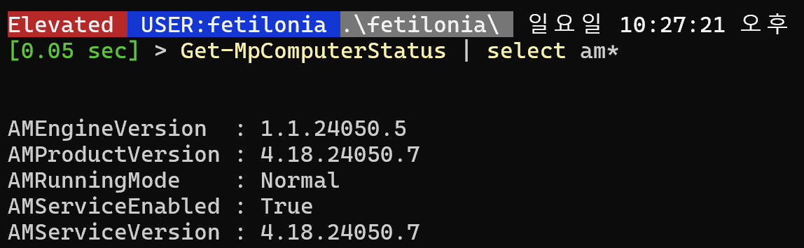
    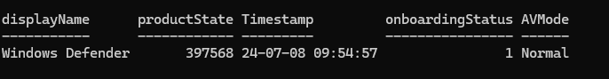
    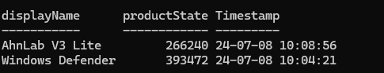
    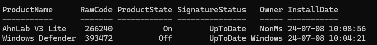
    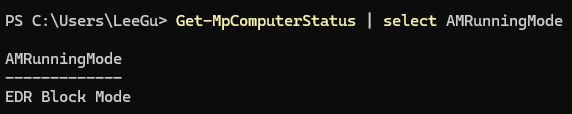
    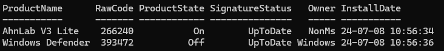
    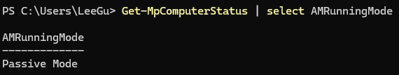

## References

- [Defender for Endpoint on Windows](https://learn.microsoft.com/en-us/defender-endpoint/microsoft-defender-endpoint-windows)
- [EDR in block mode FAQ](https://learn.microsoft.com/en-us/defender-endpoint/edr-block-mode-faqs)
- [Notion source](https://app.notion.com/p/28fdbd591ead802eade0ea8312188c12)
