# Microsoft Defender for Endpoint Application Context

Microsoft Entra application의 client credentials flow로 Microsoft Defender for Endpoint API를 호출하는 구조와 검증 절차입니다.

!!! warning "Credential 및 API boundary"
    secret, private key와 access token을 문서나 screenshot에 남기지 않습니다. Microsoft Graph Security API와 Defender for Endpoint API는 endpoint·permission·schema가 다르므로 token audience를 혼용하지 않습니다.

## 절차

1. Microsoft Entra ID에 application을 등록합니다.
2. **WindowsDefenderATP** API의 최소 application permission을 부여합니다.
3. admin consent 후 `https://api.security.microsoft.com/.default` scope로 token을 요청합니다.
4. bearer token으로 Defender API를 호출하고 HTTP status, request ID, token role과 workload 결과를 함께 검증합니다.

```powershell
$TenantId = '<tenant-id>'
$ClientId = '<application-id>'
$ClientSecret = Read-Host 'Client secret' -AsSecureString
$Token = Invoke-RestMethod -Method Post `
  -Uri "https://login.microsoftonline.com/$TenantId/oauth2/v2.0/token" `
  -ContentType 'application/x-www-form-urlencoded' -Body @{
    client_id=$ClientId
    client_secret=[System.Net.NetworkCredential]::new('', $ClientSecret).Password
    scope='https://api.security.microsoft.com/.default'
    grant_type='client_credentials'
  }
$Headers = @{ Authorization="Bearer $($Token.access_token)" }
Invoke-RestMethod -Uri 'https://api.security.microsoft.com/api/alerts' -Headers $Headers
```

| 결과 | 우선 확인 |
|---|---|
| `401` | audience, expiry, malformed header |
| `403` | application role, consent, Defender RBAC |
| `200`, 빈 collection | retention, filter, alert 존재 여부 |

## 원문 증적

??? example "Application Context 검증 화면"
    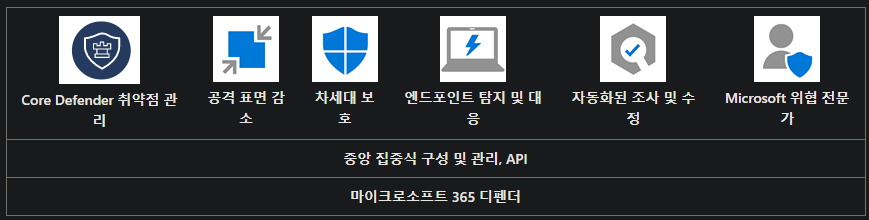
    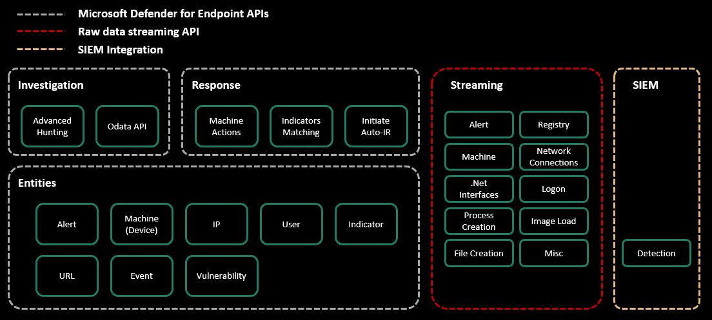
    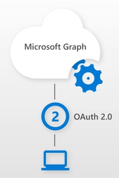
    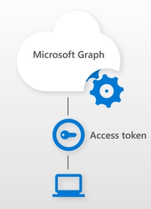
    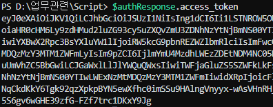
    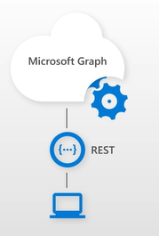
    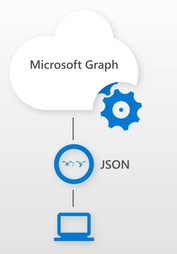
    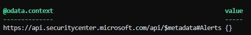
    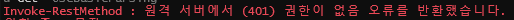
    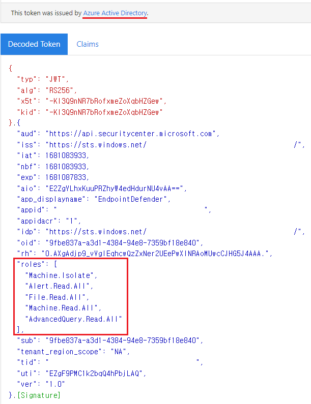
    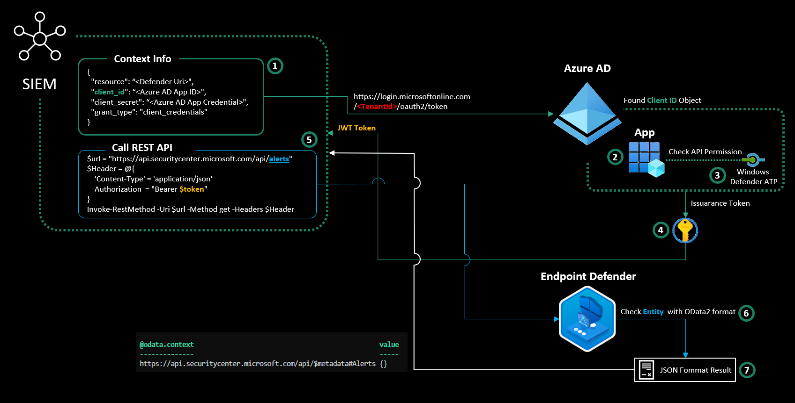

## References

- [Access Defender for Endpoint APIs](https://learn.microsoft.com/en-us/defender-endpoint/api/apis-intro)
- [Supported APIs](https://learn.microsoft.com/en-us/defender-endpoint/api/exposed-apis-list)
- [Notion source](https://app.notion.com/p/28fdbd591ead80f4ae29e06d5b590ac3)
