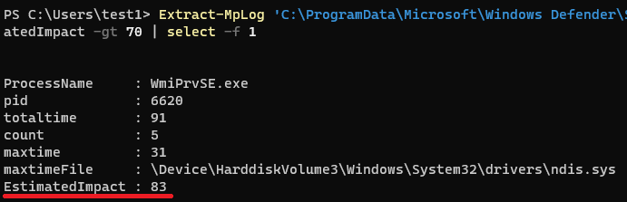
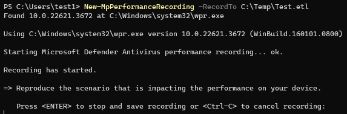
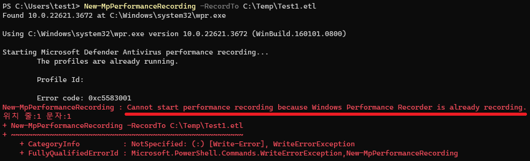
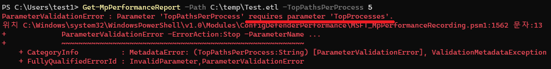
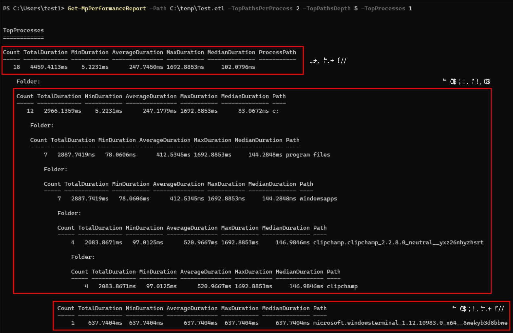
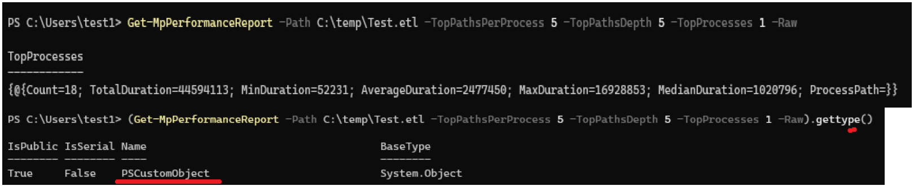
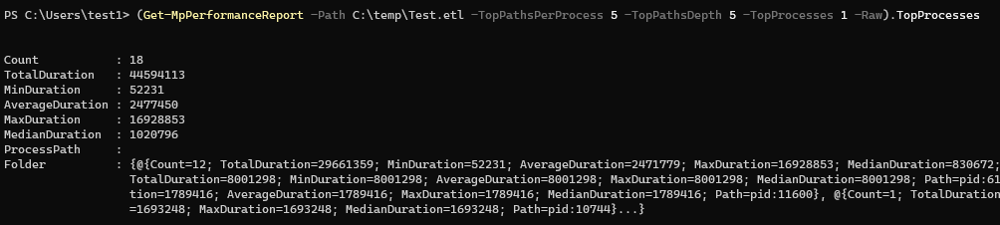
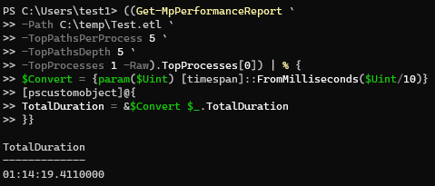
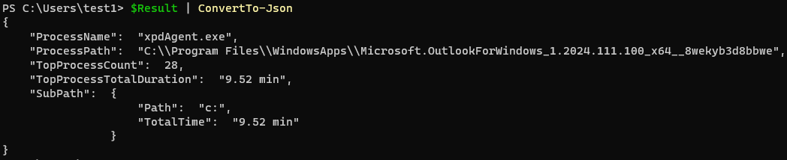

# Microsoft Defender Antivirus Performance Analyzer

Defender Antivirus 성능 문제를 ETL로 수집하고 `Get-MpPerformanceReport`로 분석하는 runbook입니다.

## Prerequisites

- Windows 10 이상, Defender platform `4.18.2108.X` 이상
- elevated PowerShell과 재현 가능한 time window
- 기존 WPR session 및 control device 확인

!!! caution "Exclusion은 결론이 아니다"
    높은 scan cost만으로 exclusion을 적용하지 않습니다. protection coverage가 줄어들므로 원인·범위·만료·rollback을 먼저 정의합니다.

```powershell
$EtlPath = 'C:\Temp\Defender-Performance.etl'
New-MpPerformanceRecording -RecordTo $EtlPath
# 문제 재현 후 Enter로 저장
$Report = Get-MpPerformanceReport -Path $EtlPath -TopFiles 20 -TopProcesses 20 -Raw
$Report.TopProcesses
$Report.TopFiles
```

충돌하는 recording의 소유자와 목적을 확인한 뒤 필요한 경우에만 중단합니다.

```powershell
wpr -cancel -instancename MSFT_MpPerformanceRecording
```

capture 시간, device, Defender platform·signature·policy version과 control 결과를 함께 보존합니다.

## 원문 증적

??? example "Performance Analyzer 검증 화면"
    
    
    
    
    
    
    
    
    

## References

- [Performance Analyzer](https://learn.microsoft.com/en-us/defender-endpoint/tune-performance-defender-antivirus)
- [Cmdlet reference](https://learn.microsoft.com/en-us/defender-endpoint/performance-analyzer-reference)
- [Notion source](https://app.notion.com/p/28fdbd591ead802abdbdf0f5a900e390)
