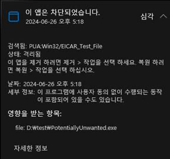
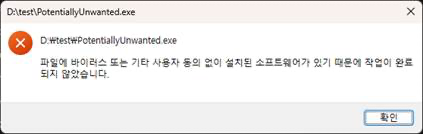
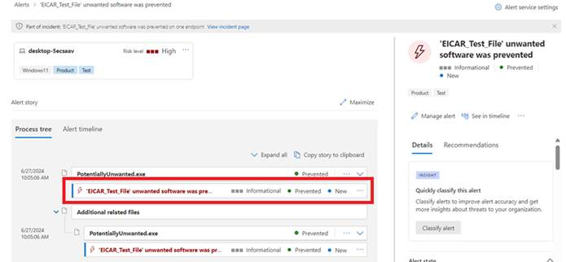
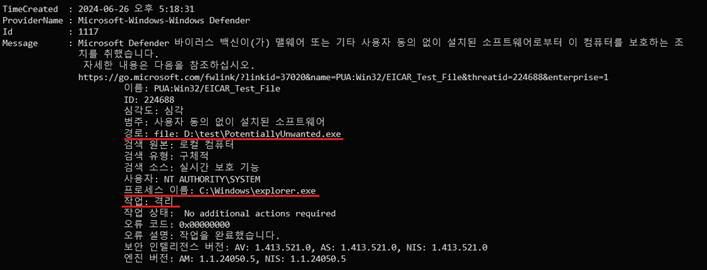
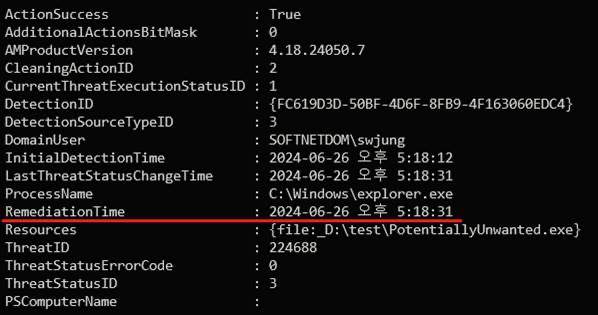
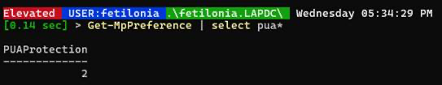
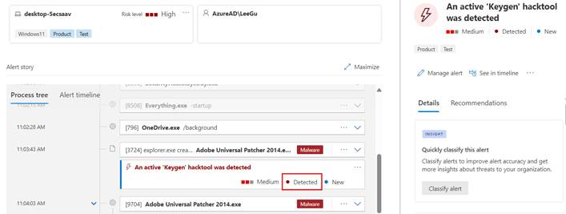
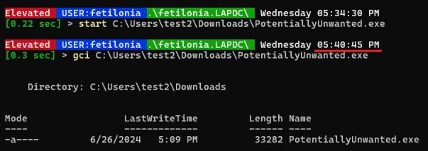
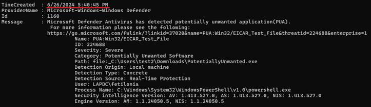

# PUA Protection Block·Audit 검증

Defender Antivirus PUA protection의 Block과 Audit 동작을 positive·negative test로 검증합니다.

!!! danger "격리된 시험 환경"
    Microsoft 공식 demonstration의 safe test file만 사용합니다. production device나 업무 network에서 임의 실행 파일로 검증하지 않습니다.

```powershell
Get-MpPreference | Select-Object PUAProtection
```

| 값 | Mode |
|---:|---|
| `0` | Disabled |
| `1` | Block |
| `2` | Audit |

중앙 정책이 관리하면 local cmdlet 성공과 effective state가 다를 수 있습니다. 변경 전 management authority와 tamper protection을 확인합니다.

```powershell
$Before = (Get-MpPreference).PUAProtection
Set-MpPreference -PUAProtection AuditMode
# 시험 종료 후 rollback
Set-MpPreference -PUAProtection $Before
```

| Test | Block | Audit |
|---|---|---|
| safe PUA test | 차단·remediation | 차단하지 않고 detection 기록 |
| Protection History | action 확인 | audit signal 확인 |
| Advanced Hunting | `AntivirusDetection` | `AntivirusDetection` |

!!! warning "원문 event ID 보정"
    원문은 Block `1117`, Audit `1160`으로 구분했지만 현재 Microsoft 공식 PUA 문서는 PUA event를 `1160`으로 안내합니다. event ID 단독으로 mode를 판정하지 말고 `WasRemediated`, Protection History와 파일 상태를 비교합니다.

```kusto
DeviceEvents
| where ActionType == "AntivirusDetection"
| extend D = parse_json(AdditionalFields)
| project Timestamp, DeviceName, FolderPath, FileName, SHA256,
  ThreatName=tostring(D.ThreatName), WasRemediated=tostring(D.WasRemediated)
| where ThreatName startswith_cs "PUA:"
```

## 원문 증적

??? example "PUA Block·Audit 검증 화면"
    
    
    
    
    
    
    
    
    
    

## References

- [Block PUA](https://learn.microsoft.com/en-us/defender-endpoint/detect-block-potentially-unwanted-apps-microsoft-defender-antivirus)
- [Demonstration scenarios](https://learn.microsoft.com/en-us/defender-endpoint/defender-endpoint-demonstrations)
- [Notion source](https://app.notion.com/p/28fdbd591ead8066963cf7942904d1dd)
