# Microsoft Graph Security API를 통한 Alert Handling

Microsoft Graph Security API를 사용해 Microsoft Defender 계열 workload에서 수집된 alert를 조회하고 상태를 업데이트하며 comment를 기록한 현장 검증 문서입니다.

!!! warning "2026년 support boundary"
    원문에는 legacy `microsoft.graph.alert`와 최신 `microsoft.graph.security.alert`가 함께 기록되어 있습니다. Microsoft는 legacy alerts API를 deprecated로 분류하고 **2026년 4월 제거 예정**으로 문서화했습니다. 신규 구현과 재검증은 `GET /security/alerts_v2` 및 관련 `alerts_v2` operation을 기준으로 수행해야 합니다.

## 검증 범위

1. Microsoft Entra ID에 application을 등록합니다.
2. Microsoft Graph application permission `SecurityAlert.ReadWrite.All`을 부여하고 admin consent를 수행합니다.
3. application context로 access token을 발급합니다.
4. `/security/alerts_v2`에서 alert를 조회합니다.
5. 허용된 속성을 업데이트하고 comment를 추가합니다.

!!! danger "Secret 취급"
    Client secret value, access token, Tenant ID와 Client ID의 실제 값은 repository, command history 및 screenshot에 노출하지 않습니다. 운영 자동화에서는 certificate 또는 managed identity 사용 가능성을 우선 검토합니다.

## Microsoft Entra application 등록

Microsoft Entra admin center에서 **App registrations > New registration**으로 application을 생성합니다.

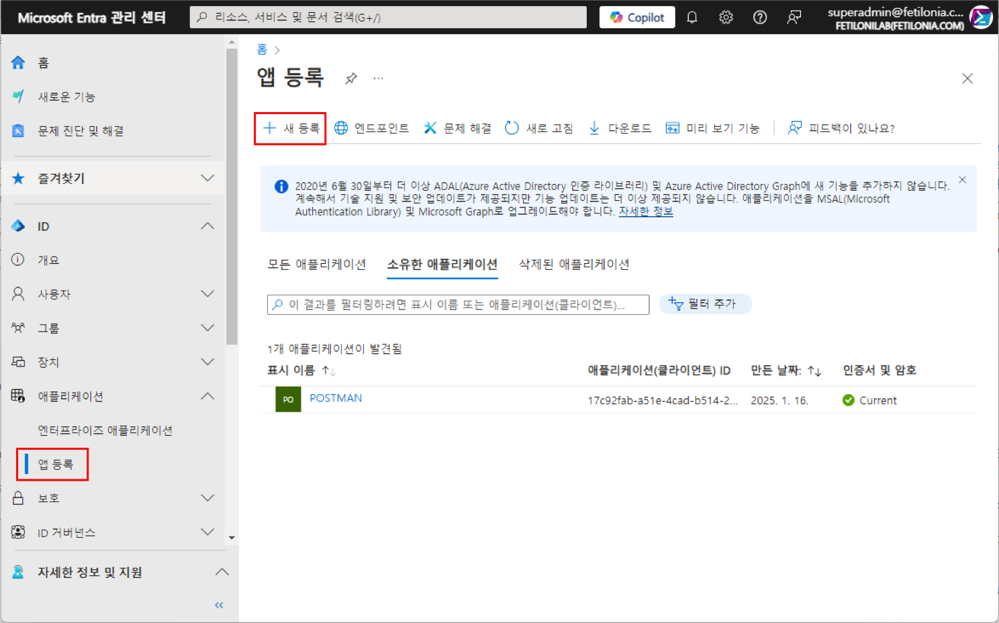

원문 검증에서는 native application redirect URI를 구성했습니다. client credentials flow만 사용하는 daemon application이라면 redirect URI는 필수 조건이 아니므로 실제 authentication flow에 맞춰 구성해야 합니다.

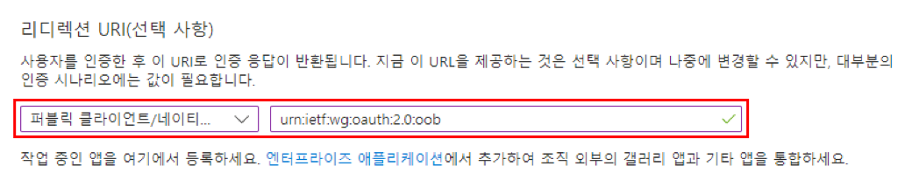

application context에 필요한 Client ID와 Tenant ID를 기록하고 credential을 생성합니다. secret value는 생성 시점에만 확인할 수 있으므로 안전한 secret store로 즉시 이동합니다.

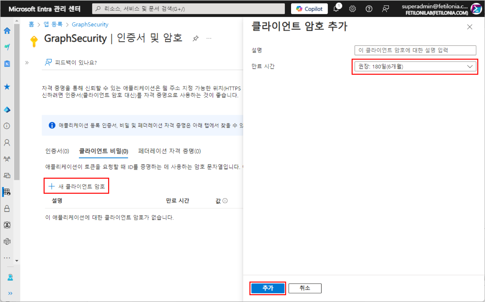

## API permission 할당

Microsoft Graph의 **Application permissions**에서 `SecurityAlert.ReadWrite.All`을 추가하고 admin consent를 수행합니다.

??? example "API permission 할당 화면"
    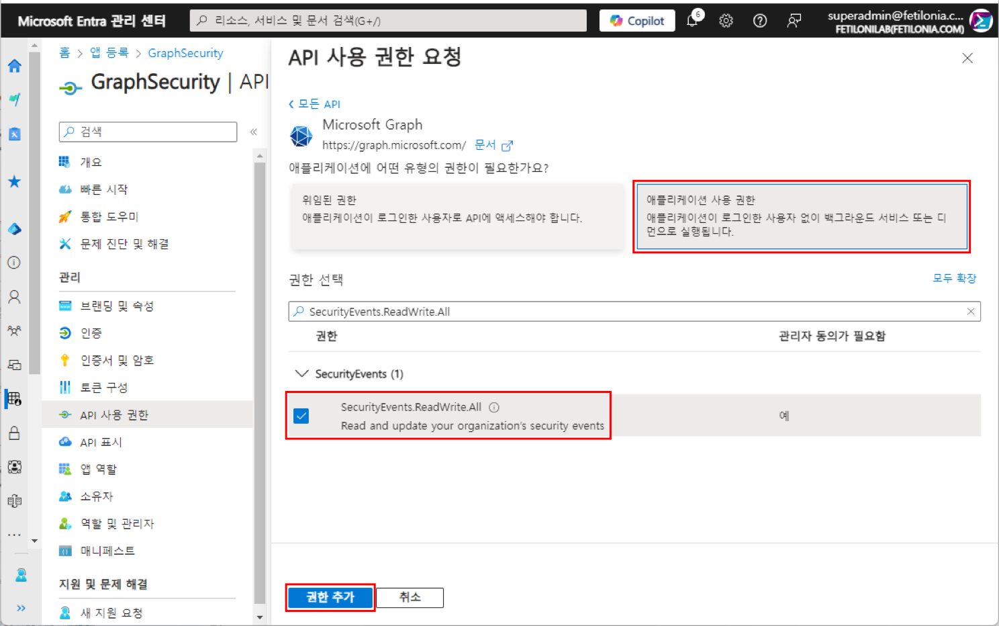

??? example "Admin consent 결과"
    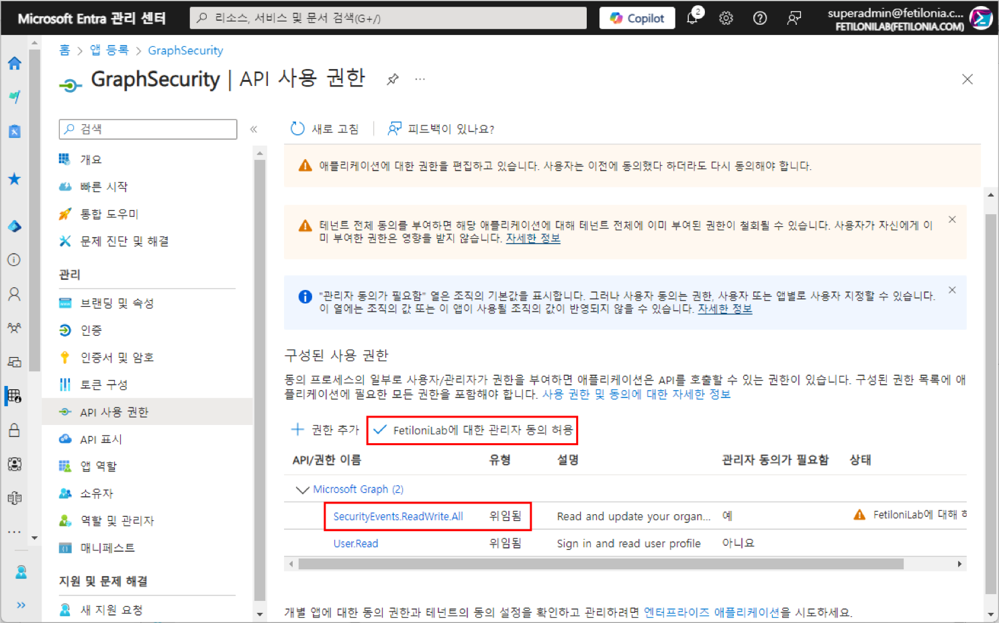

## Alert 조회

application token을 `Authorization: Bearer <token>` header에 전달하고 다음 endpoint를 호출합니다.

```http
GET https://graph.microsoft.com/v1.0/security/alerts_v2
Authorization: Bearer <token>
```

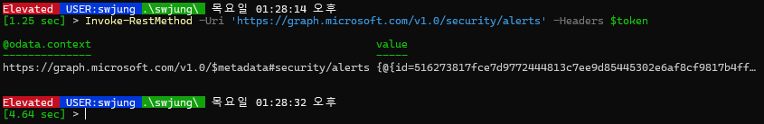

응답이 `200 OK`인 것만으로 workload 데이터가 완전하다고 판단할 수 없습니다. `@odata.nextLink` pagination, retention 범위, provider별 ingestion 상태와 대상 alert의 `id`, `serviceSource`, `createdDateTime`을 함께 검증합니다.

## Alert 업데이트

`alerts_v2`의 update operation은 alert의 `assignedTo`, `classification`, `determination`, `status` 등을 업데이트하는 데 사용합니다. 실제 허용 조합과 enum 값은 현재 API reference를 기준으로 검증합니다.

| Operation | Endpoint | 목적 |
|---|---|---|
| 조회 | `GET /security/alerts_v2` | alert collection 조회 |
| 업데이트 | `PATCH /security/alerts_v2/{alertId}` | 상태·분류·결정·담당자 변경 |
| comment | `POST /security/alerts_v2/{alertId}/comments` | analyst comment 추가 |

원문은 legacy와 modern endpoint의 request body 차이를 각각 검증했습니다.

??? example "alerts_v2 request body"
    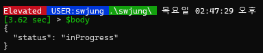

??? example "Legacy alert request body"
    legacy endpoint에는 provider-specific 요구사항이 존재했습니다. 신규 구현 기준으로 재사용하지 않습니다.

    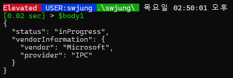

legacy request에서 예상하지 않은 field 또는 필수 provider 정보가 누락되면 오류가 발생했습니다.

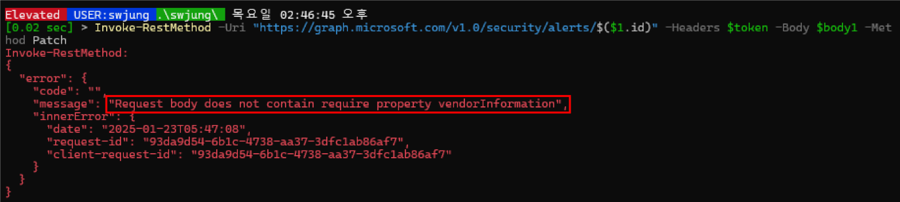

!!! warning "ID namespace"
    legacy alert ID와 `alerts_v2` alert ID는 동일하다고 가정할 수 없습니다. endpoint 전환 시 기존 ID를 재사용하지 말고 대상 collection에서 stable correlation field와 함께 다시 resolve합니다.

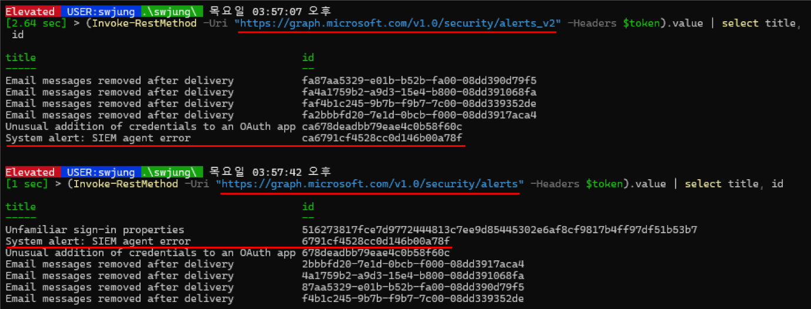

### Before/After evidence

??? example "Legacy endpoint — PATCH 전/후"
    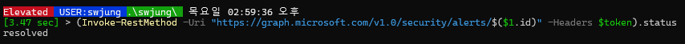

    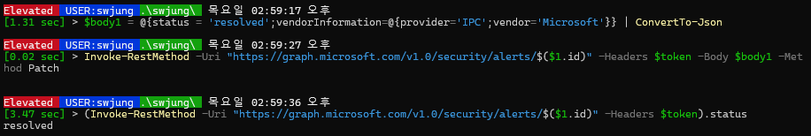

??? example "alerts_v2 endpoint — PATCH 전/후"
    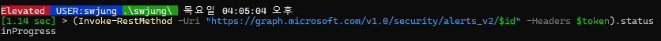

    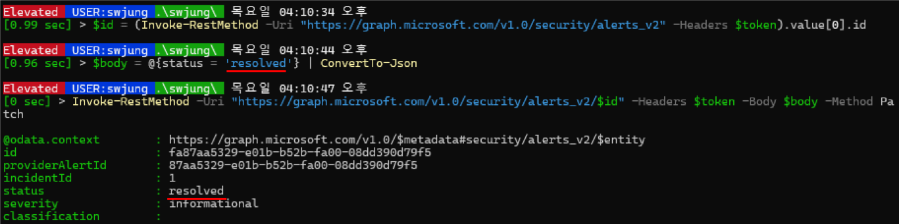

## Alert comment 작성

comment는 다음 endpoint에 추가합니다. application permission과 delegated permission 모두 `SecurityAlert.ReadWrite.All`이 최소 권한으로 문서화되어 있습니다.

```http
POST https://graph.microsoft.com/v1.0/security/alerts_v2/{alertId}/comments
Authorization: Bearer <token>
Content-Type: application/json

{
  "@odata.type": "microsoft.graph.security.alertComment",
  "comment": "Investigation note"
}
```

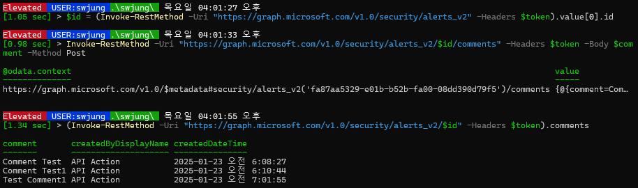

UI에는 API action을 수행한 principal과 UTC 기반 `createdDateTime`이 표시됩니다. evidence 수집 시 portal 표시 시간과 API timestamp를 동일 timezone으로 정규화합니다.

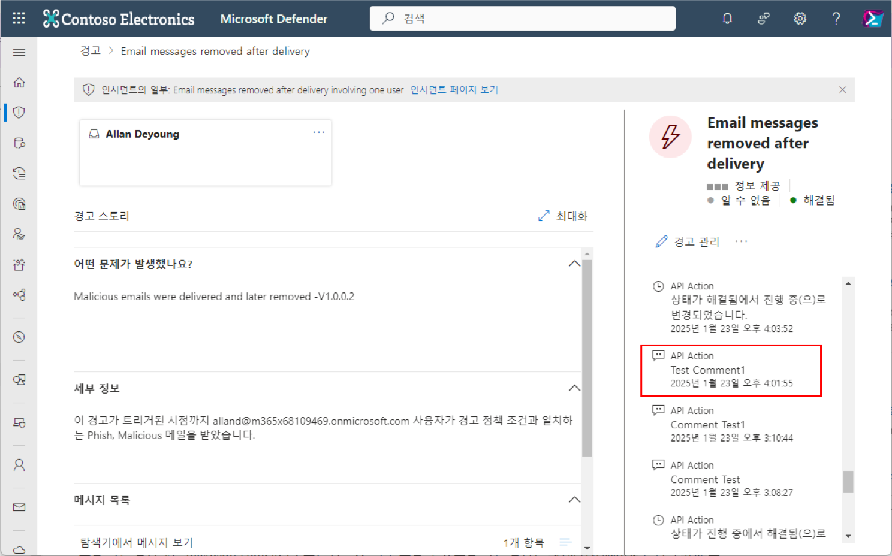

## 검증 매트릭스

| Test ID | Scenario | Preconditions | Action | Expected result | Evidence |
|---|---|---|---|---|---|
| GS-01 | 허용 경로: alert 조회 | application consent 완료 | `GET /security/alerts_v2` | `200 OK`, target alert 반환 | HTTP status, request ID, alert ID, timestamp |
| GS-02 | 차단 경로: 권한 없는 조회 | permission 미부여 control app | 동일 GET | `403 Forbidden` | response body, request ID, timestamp |
| GS-03 | 허용 경로: 상태 변경 | 변경 가능한 test alert | PATCH 후 재조회 | 요청 값과 workload 상태 일치 | before/after JSON과 portal |
| GS-04 | 허용 경로: comment | test alert 존재 | comment POST | `200 OK`, comment collection 및 portal 표시 | response JSON과 portal |
| GS-05 | 차단 경로: invalid alert ID | 존재하지 않는 ID | PATCH 또는 POST | documented error response | HTTP status, error code, request ID |

## Rollback

- test alert의 변경 전 `status`, `classification`, `determination`, `assignedTo`를 JSON으로 보존합니다.
- 검증 종료 후 변경 가능한 속성을 원래 값으로 PATCH하고 동일 observation point에서 확인합니다.
- 생성한 comment는 API에서 임의 삭제 가능한 것으로 가정하지 않습니다. 운영 alert가 아닌 test alert를 사용합니다.
- pilot application credential은 시험 종료 후 revoke하고, 불필요한 API permission과 service principal을 제거합니다.

## Source 및 공식 문서

- [Notion 원문](https://app.notion.com/p/290dbd591ead80c8a7a7d5e26360c0e6)
- [Use the Microsoft Graph security API](https://learn.microsoft.com/en-us/graph/api/resources/security-api-overview?view=graph-rest-1.0)
- [List alerts_v2](https://learn.microsoft.com/en-us/graph/api/security-list-alerts_v2?view=graph-rest-1.0)
- [alert resource type](https://learn.microsoft.com/en-us/graph/api/resources/security-alert?view=graph-rest-1.0)
- [Create comment for alert](https://learn.microsoft.com/en-us/graph/api/security-alert-post-comments?view=graph-rest-1.0)
